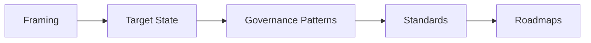

# Blueprint Index

This index gives the enterprise architecture blueprint repository a practical structure for reference and reuse.
Use it as the starting point for selecting the right blueprint family.

## Purpose

Use this index to organize target-state blueprints, standards, governance patterns, and modernization sequences.

## Selector Table

| Blueprint Family | Best For | Related Artifact |
| --- | --- | --- |
| Target State Architecture | Defining the future shape | Target state architecture |
| Governance Patterns | Controlling architecture decisions | Architecture review board |
| Modernization Patterns | Sequencing change | Transformation roadmap |
| Integration Patterns | Aligning systems and data flow | Enterprise integration |
| Roadmap Patterns | Planning execution waves | Cloud modernization roadmap |

## Selector Table

| Blueprint Family | Best For | Related Artifact |
| --- | --- | --- |
| Target State Architecture | Defining the future shape | Target state architecture |
| Governance Patterns | Controlling architecture decisions | Architecture review board |
| Modernization Patterns | Sequencing change | Transformation roadmap |
| Integration Patterns | Aligning systems and data flow | Enterprise integration |
| Roadmap Patterns | Planning execution waves | Cloud modernization roadmap |

## Blueprint Families

### 1. Target State Architecture

- business capability maps
- technology capability maps
- integration patterns

### 2. Governance Patterns

- architecture review board patterns
- lifecycle management patterns
- standards enforcement

### 3. Modernization Patterns

- cloud migration patterns
- hybrid cloud patterns
- platform transition patterns

### 4. Integration Patterns

- enterprise integration models
- API and event patterns
- data flow diagrams

### 5. Roadmap Patterns

- modernization roadmaps
- transition waves
- dependency sequencing

## Example Blueprint View

| Blueprint | Purpose | Status |
| --- | --- | --- |
| Business Capability Map | Strategy alignment | Ready |
| Cloud Architecture Standards | Control and consistency | Ready |
| Hybrid Cloud Architecture | Target state | In Progress |
| Transformation Roadmap | Sequencing | Ready |

## Figure

## Recommended Actions

- keep each blueprint tied to a business capability
- separate standards from target state patterns
- use one review path for architecture approvals
- link every blueprint back to the hub repo
- keep the naming consistent across blueprint families

## Use

Use this page as the selector for the blueprint family you need.

## Outcome

A clear blueprint index makes it easier to move from strategy to a usable architecture asset.

## Blueprint Rule

Each blueprint should describe the intended architecture clearly enough that a reviewer can understand the rationale and the path to implementation.

## Related Artifacts

- [Framework Overview](../docs/framework-overview.md)
- [Architecture Principles](../docs/architecture-principles.md)
- [Target State Architecture](../docs/target-state-architecture.md)
- [Cloud Modernization Roadmap](../roadmaps/cloud-modernization-roadmap.md)

## Blueprint Rule

Each blueprint should answer what problem it solves, what decision it informs, and what artifact should follow next.

## Blueprint Rule

Each blueprint should answer what problem it solves, what decision it informs, and what artifact should follow next.
