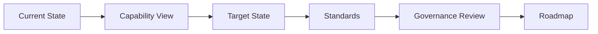

# Framework Overview

## What This Repository Does

This repository gives architecture teams a practical set of blueprints, standards, and governance models that can be reused across transformation programs.
It gives the organization a repeatable way to frame target state, standards, and roadmap decisions.
The framework is meant to reduce ambiguity and keep architecture decisions connected to execution.
The framework is also intended to make the architecture story easy to show from the parent MCGR page and related ecosystem pages.

## Architecture Flow

## What It Covers

- current and target-state architecture
- business and technology capability mapping
- architecture governance
- cloud standards
- integration patterns
- modernization roadmaps

## Who Uses It

- enterprise architects
- solution architects
- cloud platform teams
- transformation leaders
- governance boards
- executive sponsors

## What Good Looks Like

- architecture decisions are documented
- standards are explicit and reusable
- target states are tied to business priorities
- roadmaps are sequenced and realistic
- review cycles are predictable
- capability maps support decision-making

## How To Read It

Start with the framework overview, then move into the blueprint index and target state architecture.
That sequence keeps the conversation focused on where the organization is going before getting into supporting detail.

## Result

The framework helps teams make architecture choices that are easier to govern, sequence, and deliver.

## How To Read It

Start with the framework overview, then move into the blueprint index and target state architecture.
That sequence keeps the conversation focused on where the organization is going before getting into supporting detail.

## Result

The framework helps teams make architecture choices that are easier to govern, sequence, and deliver.

## Practical Use

Use this framework when you need to compare current state to a target architecture and explain the transition path.

## Outputs

- capability maps
- target-state views
- design standards
- review templates
- modernization plans

## Architecture Layers

| Layer | Question | Artifact |
| --- | --- | --- |
| Framing | Where are we going? | Framework overview |
| Capability | What must change? | Capability maps |
| Structure | What should the target look like? | Target state architecture |
| Control | What standards apply? | Cloud architecture standards |
| Transition | How do we get there? | Modernization roadmap |
